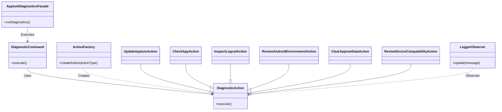
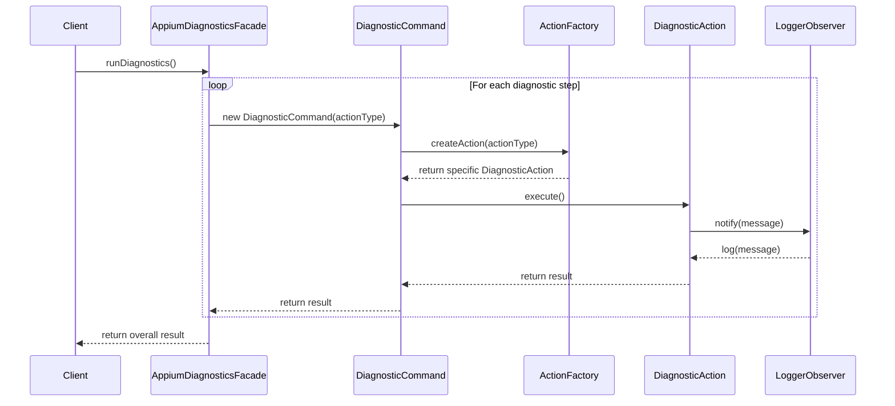

```mermaid
classDiagram
    class AppiumDiagnosticsFacade {
        +runDiagnostics()
    }
    class ActionFactory {
        +createAction(actionType)
    }
    class DiagnosticAction {
        +execute()
    }
    class UpdateAppiumAction
    class CheckAppAction
    class InspectLogcatAction
    class ReviewAndroidEnvironmentAction
    class ClearAppiumDataAction
    class ReviewDeviceCompatibilityAction
    class LoggerObserver {
        +update(message)
    }
    class DiagnosticCommand {
        +execute()
    }

    AppiumDiagnosticsFacade --> DiagnosticCommand : Executes
    DiagnosticCommand --> DiagnosticAction : Uses
    ActionFactory ..> DiagnosticAction : Creates
    UpdateAppiumAction --|> DiagnosticAction
    CheckAppAction --|> DiagnosticAction
    InspectLogcatAction --|> DiagnosticAction
    ReviewAndroidEnvironmentAction --|> DiagnosticAction
    ClearAppiumDataAction --|> DiagnosticAction
    ReviewDeviceCompatibilityAction --|> DiagnosticAction
    LoggerObserver ..> DiagnosticAction : Observes
```

```mermaid
sequenceDiagram
    participant Client
    participant AppiumDiagnosticsFacade
    participant DiagnosticCommand
    participant ActionFactory
    participant DiagnosticAction
    participant LoggerObserver

    Client->>AppiumDiagnosticsFacade: runDiagnostics()
    loop For each diagnostic step
        AppiumDiagnosticsFacade->>DiagnosticCommand: new DiagnosticCommand(actionType)
        DiagnosticCommand->>ActionFactory: createAction(actionType)
        ActionFactory-->>DiagnosticCommand: return specific DiagnosticAction
        DiagnosticCommand->>DiagnosticAction: execute()
        DiagnosticAction->>LoggerObserver: notify(message)
        LoggerObserver-->>DiagnosticAction: log(message)
        DiagnosticAction-->>DiagnosticCommand: return result
        DiagnosticCommand-->>AppiumDiagnosticsFacade: return result
    end
    AppiumDiagnosticsFacade-->>Client: return overall result
```

https://chat.openai.com/share/133690b7-cd4e-4866-993c-a885d714500d
